# tradeX — Solution Architecture

> Version 0.1 · Companion to [PRODUCT_SPEC.md](PRODUCT_SPEC.md)
> Owner: Engineering · Audience: Engineers, DevOps, SREs, security reviewers

This document describes **how** tradeX is built — the systems, data flows, integration patterns, and operational model. For **what** tradeX does (features, UX, personas), see [PRODUCT_SPEC.md](PRODUCT_SPEC.md).

---

## Table of Contents

1. [Executive Summary](#1-executive-summary)
2. [Architecture Principles](#2-architecture-principles)
3. [System Context (C4 L1)](#3-system-context-c4-l1)
4. [Container View (C4 L2)](#4-container-view-c4-l2)
5. [Technology Stack](#5-technology-stack)
6. [Core Subsystems](#6-core-subsystems)
7. [Critical Sequence Flows](#7-critical-sequence-flows)
8. [Data Architecture](#8-data-architecture)
9. [Event-Driven Model](#9-event-driven-model)
10. [API Architecture](#10-api-architecture)
11. [Security Architecture](#11-security-architecture)
12. [Multi-Tenancy Model](#12-multi-tenancy-model)
13. [Deployment Topology](#13-deployment-topology)
14. [Environments & Promotion](#14-environments--promotion)
15. [Observability Architecture](#15-observability-architecture)
16. [Resilience & Disaster Recovery](#16-resilience--disaster-recovery)
17. [Scalability Plan](#17-scalability-plan)
18. [Cost Model](#18-cost-model)
19. [Architecture Decision Records](#19-architecture-decision-records)
20. [Glossary](#20-glossary)

---

## 1. Executive Summary

tradeX is a **multi-tenant SaaS** that sits between three external systems — a user's Telegram account, a user's stockbroker (Zerodha Kite initially), and an LLM provider (OpenAI) — and turns Telegram trading signals into disciplined, rails-governed trades in the user's own broker account.

The platform is composed of two application tiers (Node + Python), backed by three primary data stores (PostgreSQL, ClickHouse, Redis) and orchestrated through a durable-workflow engine (Temporal). It runs in a single region (AWS `ap-south-1` Mumbai) with multi-AZ redundancy and a warm standby in `ap-south-2` for disaster recovery.

The design is driven by three non-negotiable constraints:
1. **Regulatory**: never hold user funds, never originate advice, every auto-action traceable to user consent
2. **Temporal sensitivity**: financial orders must be placed, observed, and exited within bounded latencies during market hours
3. **Multi-tenant isolation**: one user's Telegram session, broker credentials, and trades must never leak into another user's data plane

---

## 2. Architecture Principles

These principles override local optimization in every tradeoff.

| # | Principle | Why it matters |
|---|---|---|
| 1 | **User-in-the-loop by default** | Auto-execution is opt-in per channel with standing consent; new features default to manual |
| 2 | **Multi-tenant isolation at every layer** | App guards + DB row-level security + per-tenant queues. No global mutable state |
| 3 | **Durable workflows for anything touching money** | Temporal workflows for order lifecycles — survive restarts, retries, partial failures |
| 4 | **Immutable audit trail** | Every trade, consent, rail decision, auth event written append-only with 7-year retention |
| 5 | **Graceful degradation over hard failures** | Kite down → manual-only mode; OpenAI down → manual review queue; never a blank error screen |
| 6 | **Observability is first-class** | Every request has a trace-id; every signal tracked end-to-end; every auto-trade replayable |
| 7 | **Secrets are envelope-encrypted** | Broker tokens and Telegram sessions encrypted via AWS KMS; never plain in DB, never in logs |
| 8 | **Idempotency everywhere on write paths** | Every mutating API accepts an `Idempotency-Key`; safe retries by default |
| 9 | **Strong consistency for money, eventual for analytics** | Postgres for trades; ClickHouse for scorecards (refreshed every 10min) |
| 10 | **Broker-agnostic from day one** | Every broker integration hides behind `IBrokerAdapter`; onboarding a new broker is a contract implementation, not a rewrite |
| 11 | **Never deploy during market hours** | 09:15-15:30 IST is a freeze unless it's a hotfix for a SEV-1 |
| 12 | **Test the paper engine against itself nightly** | Paper-vs-live drift >5% triggers an incident; scorecards lose credibility otherwise |

---

## 3. System Context (C4 L1)

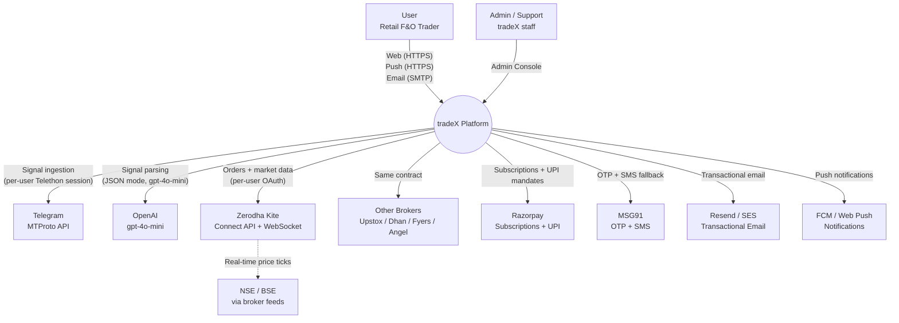

**Key takeaways**:
- tradeX never talks to NSE/BSE directly — market data always flows through the user's broker.
- Every external system is a failure point; the resilience playbook in §16 describes behavior under each.
- Telegram uses **user sessions** (Telethon server-side), not the Bot API — this is what lets us see channels the user is already a member of.

---

## 4. Container View (C4 L2)

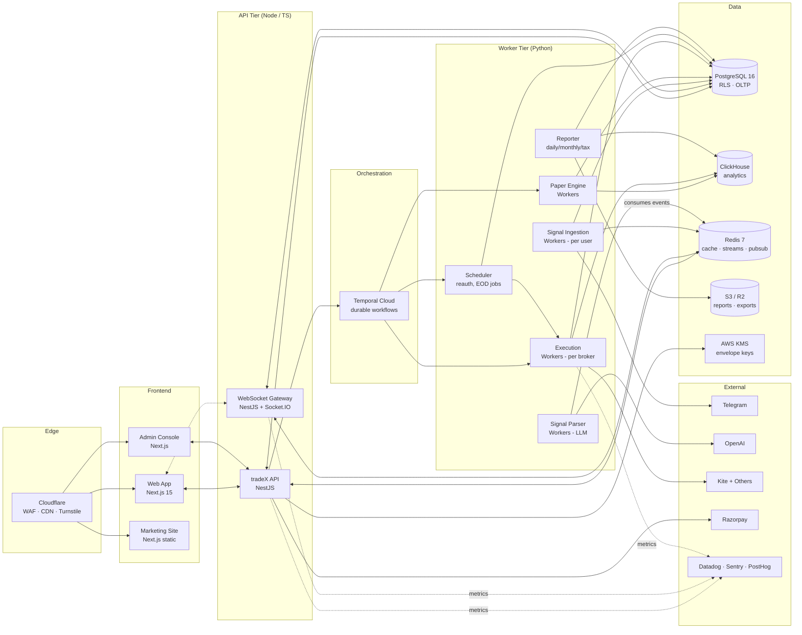

### 4.1 Why Node + Python split

- **NestJS handles**: user/auth, CRUD, business rules, billing, WebSocket fanout, API surface — areas where TS type-parity with the frontend is a productivity win.
- **Python handles**: LLM parsing, Telethon clients, broker SDKs, paper-trading simulation — areas where the library ecosystem is Python-native and where we reuse code from the existing legacy bot.

The two tiers share nothing at runtime except Postgres, Redis, and Temporal. They communicate via events (Redis Streams) and by reading each other's writes in Postgres.

---

## 5. Technology Stack

| Layer | Technology | Version | Rationale |
|---|---|---|---|
| Edge / CDN | Cloudflare | — | WAF, DDoS, Turnstile captcha, global PoPs |
| Web framework | Next.js App Router | 15 | RSC reduces bundle; SSR for SEO-critical pages |
| UI runtime | React | 19 | Concurrent features; Server Components |
| Styling | Tailwind + shadcn/ui | latest | Copy-in components give us ownership |
| Client state | Zustand | 4.x | Small, typed, unopinionated |
| Server state | TanStack Query | 5.x | Cache, revalidation, optimistic updates |
| Forms | React Hook Form + Zod | latest | Performance + shared schema with BE |
| Charts | Lightweight Charts | 4.x | Financial-grade, Apache 2.0, no brand pollution |
| API framework (Node) | NestJS | 10.x | DI, guards, module boundaries — enterprise ergonomics |
| API framework (Python) | FastAPI | 0.11x | Async, Pydantic typing, worker glue |
| Workers (Python) | Celery + Temporal | Celery 5 · Temporal 1.x | Celery for fire-and-forget, Temporal for durable workflows |
| Durable workflows | Temporal Cloud | managed | Order lifecycle, reauth, long-running paper sims |
| OLTP DB | PostgreSQL | 16 | RLS, JSONB, PG-native extensions (timescaledb for MTM ticks) |
| ORM (Node) | Prisma | 5.x | Type-safe, migration-first |
| ORM (Python) | SQLAlchemy 2.0 + Alembic | — | Async support; migrations |
| Analytics DB | ClickHouse Cloud | managed | Columnar, cheap, multi-minute ingestion |
| Cache / queue / pubsub | Redis (Upstash) | 7.x | Streams, pub/sub, token buckets |
| Auth | Clerk (v1) | — | Speed-to-market; migration door open |
| Secrets | AWS Secrets Manager + KMS | — | Envelope encryption for user-tenant secrets |
| Payments | Razorpay | Subscriptions API | India de-facto |
| SMS / OTP | MSG91 | — | India-first, cheap |
| Email | Resend | — | Modern API; React Email templates |
| Push | Web Push + FCM | — | Service-worker based for web |
| LLM | OpenAI gpt-4o-mini | Chat Completions w/ JSON mode | Cost + quality; regex fallback as degradation |
| Observability | Datadog | — | APM + logs + metrics in one pane |
| Error tracking | Sentry | — | FE + BE exceptions, session replay |
| Product analytics | PostHog Cloud | — | Events + feature flags + replay |
| IaC | Terraform + AWS CDK | 1.x / 2.x | TF for AWS primitives, CDK for app-specific constructs |
| Orchestration | AWS ECS Fargate (v1) | — | Simpler ops than EKS; revisit at 50+ services |
| Container registry | AWS ECR | — | Native, signed, scanned |
| CI/CD | GitHub Actions + Turbo cache | — | Pipeline speed critical as repo grows |
| Package manager | pnpm | 9.x | Workspace-native, fast |
| Monorepo | Turborepo | latest | Caching, task orchestration |
| Testing | Vitest · pytest · Playwright · k6 | — | Pyramid across languages |

---

## 6. Core Subsystems

Each subsystem has an owner module in the monorepo, a clear contract, and independent deploy cadence.

### 6.1 Identity & Access

```
apps/api/src/modules/auth
apps/api/src/modules/users
packages/sdk-client (auth helpers)
```

**Responsibilities**: Signup, login, 2FA, session management, role-based access, risk-profile storage, DPDP consent ledger.

**Key flows**:
- Phone OTP via MSG91 → Clerk → internal user record creation
- JWT access tokens (15 min) + refresh tokens (30 d), rotated on every refresh
- WebAuthn/biometric for trade authorization (mobile web)
- Risk-profile changes require password re-auth + 24h cooldown before new limits apply (prevents impulsive loosening after a loss)

**Data owned**: `users`, `sessions`, `risk_profiles`, `consent_records`.

### 6.2 Connections (Broker + Telegram)

```
apps/api/src/modules/connections
apps/workers/ingestion (Telegram session lifecycle)
packages/sdk-broker (Kite, Upstox, Dhan, Fyers, Angel adapters)
```

**Responsibilities**: OAuth flows, session/token storage (envelope-encrypted), health monitoring, daily refresh orchestration.

**Contract** (`IBrokerAdapter`):
```typescript
interface IBrokerAdapter {
  authenticate(user: User): Promise<AuthResult>
  refresh(token: Token): Promise<Token>
  placeOrder(order: OrderRequest, idempotencyKey: string): Promise<OrderResponse>
  modifyOrder(id: string, changes: OrderModification): Promise<OrderResponse>
  cancelOrder(id: string): Promise<CancelResponse>
  getPositions(): Promise<Position[]>
  getMargin(): Promise<Margin>
  subscribeTicks(symbols: string[], cb: TickCallback): Subscription
  getInstruments(): Promise<Instrument[]>
  healthCheck(): Promise<HealthStatus>
}
```

**Telegram session lifecycle**:
1. User submits phone → server calls `send_code_request()` via Telethon
2. User submits OTP → server calls `sign_in()`; if 2FA, prompt for password
3. Session string serialized, envelope-encrypted via KMS, stored in `telegram_connections.encrypted_session`
4. Ingestion worker hydrates session, subscribes to user's selected chat IDs
5. On Telethon exceptions (session expired, rate limited, phone ban), mark status `expired` and notify user

### 6.3 Signal Ingestion

```
apps/workers/ingestion (Python, async)
```

**Responsibilities**: Maintain one long-lived Telethon client per user, poll selected channels, emit raw messages to the parser.

**Topology**:
- One **ingestion pod** handles up to ~200 concurrent user sessions
- Per-user async tasks within the pod, sharing one event loop
- Pod failure → Kubernetes restarts; sessions rehydrated from Postgres on boot
- Users pinned to specific pods via consistent hashing on `user_id` to avoid session churn

**Flow per message**:
```
Telegram message arrives
  → Age filter (drop if >60s old)
  → Length filter (<10 chars or >30 words = noise, drop)
  → Emit to Redis Stream `signals.raw` with { user_id, channel_id, raw_text, received_at }
  → Update Telethon baseline for that user/channel
```

**Rate limit handling**: per-user FloodWaitError tracked in Redis; on trigger, pause that user's polling and back off exponentially.

### 6.4 Signal Parsing

```
apps/workers/parser (Python)
packages/llm-prompts (versioned system prompts)
```

**Responsibilities**: Consume `signals.raw` → call OpenAI with the versioned system prompt → validate JSON structure → dedup → emit to `signals.parsed`.

**Dedup window**: hash of (user_id, channel_id, normalized_text) kept in Redis for 5 min. Collisions drop silently.

**Collation**: signals marked `parsed_ok=false` with symbol but missing targets/SL → stored in per-user `pending_signals` hash with 5-min TTL. Subsequent continuation messages merge the parts.

**Fallback**: on OpenAI 5xx/timeouts, signal queued for manual review (notified to user). No regex fallback in v1 — the LLM is the contract.

**Cost monitoring**: per-tenant token spend tracked; circuit breaker trips at 100x expected usage per user per day.

### 6.5 Risk Engine

```
packages/risk-engine (shared Node + Python via WASM OR mirrored libraries)
```

**Responsibilities**: Evaluate a pre-trade decision against user's risk profile and return `allow | block | warn` with reasons.

**Rails (14 total)**: daily loss, weekly loss, max concurrent, max per-signal capital, max lots, index whitelist, time-window, BTST, min margin, max SL distance, consecutive loss, IV halt, gap halt, circuit halt.

**Runs in two places**:
- Paper engine — uses simulated balance
- Live execution worker — uses real Kite margin

Both import from the same `risk-engine` package. The Python side uses the Node version compiled to a subprocess CLI or a WASM build loaded into Python — keeping one source of truth for rail math.

### 6.6 Paper Trading Engine

```
apps/workers/paper-engine (Python + Temporal workflows)
```

**Responsibilities**: Simulate fills, exits, and PnL for every signal that passes channel-is-in-evaluation-mode, using the same risk engine and exit rules as live.

**Per-channel isolation**: each channel has its own `paper_wallets` row with starting balance and current balance. A signal that would breach that wallet's rails is rejected — just like live.

**Fill simulation**:
- On signal arrival: wait for next LTP tick
- On next tick: simulate market fill at `tick + slippage(symbol_liquidity)`
- For illiquid strikes: simulate partial fills

**Exit simulation**: every tick, paper positions re-evaluate against SL / targets / trailing / EOD. Exits recorded with same event schema as live.

**Output events** to ClickHouse: `paper_order_placed`, `paper_order_filled`, `paper_partial_exit`, `paper_trade_closed`.

### 6.7 Live Execution Engine

```
apps/workers/executor (Python + Temporal)
```

**Responsibilities**: Convert a user-approved (or standing-consent-approved) signal into a broker order and manage its lifecycle until close.

**Temporal workflow** `TradeLifecycleWorkflow(trade_id)`:
```
1. Wait for entry trigger (WAITING_ENTRY state)
2. Place MARKET order via broker adapter → ORDER_PENDING
3. Poll fill status or subscribe to order-update stream
4. On fill → ENTERED, subscribe to ticks
5. Monitor for exit conditions:
   a. SL hit → place exit order → STOPPED_OUT
   b. Target hit → partial exit 50% → PARTIAL_EXIT → activate trailing SL
   c. Trailing SL hit → exit remainder → COMPLETED
   d. EOD (15:15 IST) → force exit → COMPLETED
   e. Panic → cancel and exit → CANCELLED
6. Write terminal state + PnL to Postgres
7. Emit trade_closed event to ClickHouse
```

Temporal gives us retry-on-failure, history replay, and ability to pause/resume.

### 6.8 Market Data Fabric

```
apps/workers/market-feed (Python)
apps/api/src/modules/stream (Node WebSocket gateway)
```

**Responsibilities**: Bridge broker WebSocket tick streams to clients (web app), and internally to paper-engine and executor.

**Fan-in / fan-out**:
- One WebSocket connection per user per broker (Kite limitation)
- Ticks published to Redis pub/sub channel `ticks.{instrument_token}`
- Node WebSocket gateway subscribes on behalf of connected clients, filtering by their favorites + active trade instruments
- Paper-engine and executor also subscribe for their positions

**Data transformations**: raw Kite binary → normalized `Tick{ symbol, ltp, volume, oi, ts_ist }` → Redis pubsub + ClickHouse `tick_samples` (1/sec sample for long-term analytics, not every tick).

**Scale note**: at 10k users × 20 subscribed symbols each = 200k subscriptions. Redis pub/sub handles ≥1M msgs/sec; the bottleneck is Kite's per-broker WebSocket limit (1 connection per Kite API key). At scale, switch to centralized vendor feed (TrueData / GlobalDatafeeds) behind the same fabric contract.

### 6.9 Notifications

```
apps/api/src/modules/notifications
apps/workers/notifier (optional — Python for templating)
```

**Channels**: web push, in-app (WebSocket), email, SMS, WhatsApp (v2).

**Pipeline**:
```
Event (e.g. signal.parsed for user X)
  → NotificationOrchestrator decides channels per user preferences
  → For each channel:
      - queue to Redis stream
      - dedicated sender consumes and dispatches
  → Delivery status logged → retries on failure
```

Templates in React Email, versioned, previewable in Storybook.

### 6.10 Billing

```
apps/api/src/modules/billing
```

**Responsibilities**: Razorpay subscription creation, webhook handling, invoice generation, tier enforcement.

**Webhooks** signed with Razorpay HMAC; processed via idempotent handlers (use Razorpay `event_id` as dedup key).

**Tier enforcement**: user's tier stored in `subscriptions.tier`; feature gates read this via `FeatureFlagGuard` on NestJS handlers and via `useEntitlement()` hook on the client.

### 6.11 Analytics & Reporting

```
apps/workers/reporter (Python)
services/clickhouse (schemas + materialized views)
```

**Responsibilities**: Build channel scorecards, daily/weekly/monthly user reports, tax exports.

**Pattern**: raw events flow into ClickHouse; materialized views (`channel_daily_stats`, `user_daily_stats`) refresh every 10 min; reporter reads from MVs for dashboards and from raw for exports.

**Exports**: user requests CSV/PDF → reporter job → S3 with presigned URL → email with link.

### 6.12 Admin Backend

```
apps/web-admin (Next.js)
apps/api/src/modules/admin (additional endpoints, RBAC-gated)
```

**Responsibilities**: User management, ops dashboards, support ticketing integration (Intercom), compliance audit log browser, platform-wide kill switch.

**Kill switch**: special admin endpoint that flips a Redis flag `platform.auto_exec_enabled = false`. All executor workers read this flag before placing every order. Sub-second effect.

---

## 7. Critical Sequence Flows

### 7.1 Signup → First Paper Trade

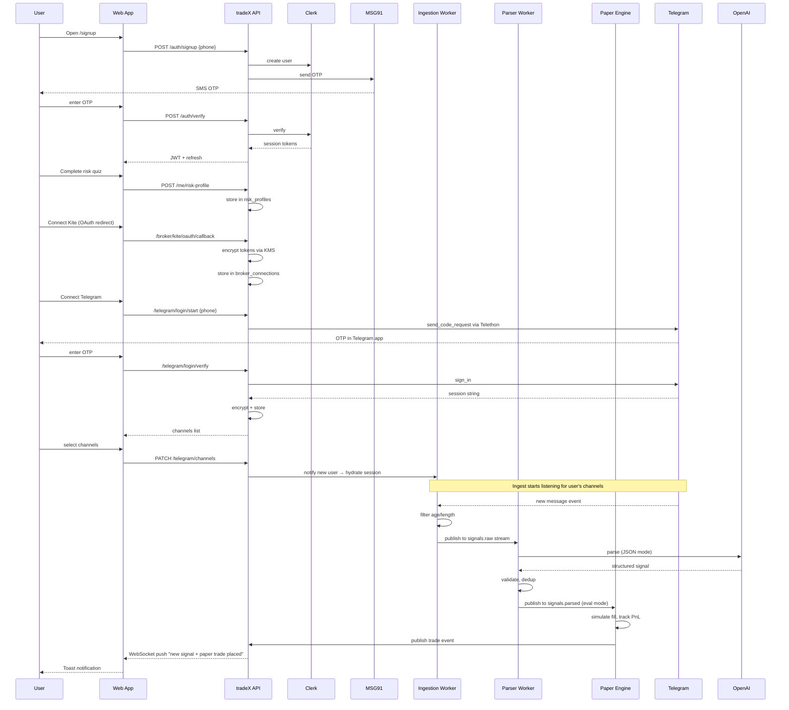

### 7.2 Live Signal → Manual Execution

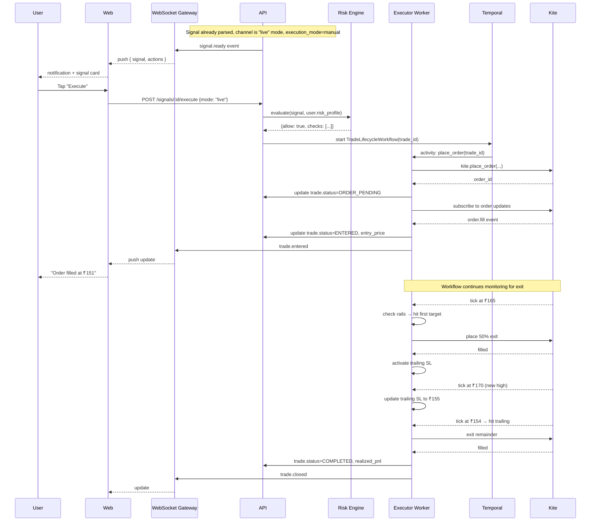

### 7.3 Morning Kite Re-authorization

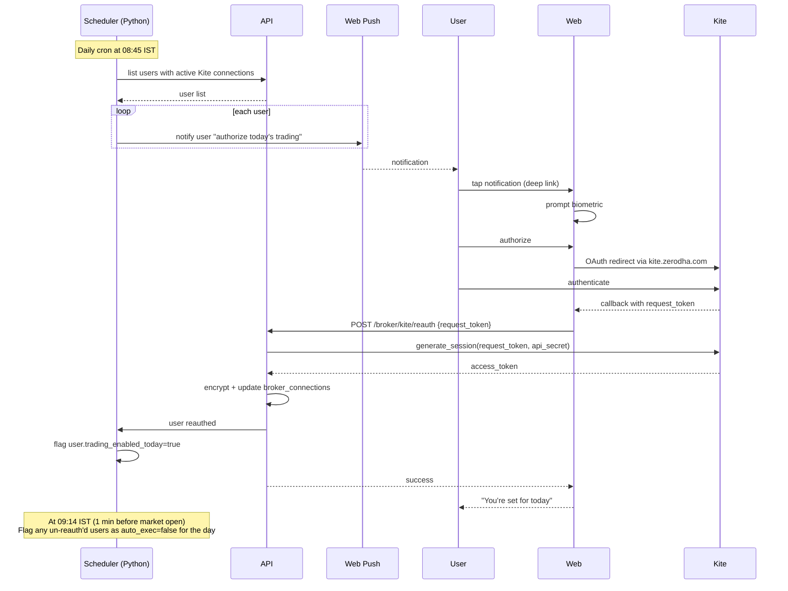

### 7.4 Channel Graduation (Eval → Live)

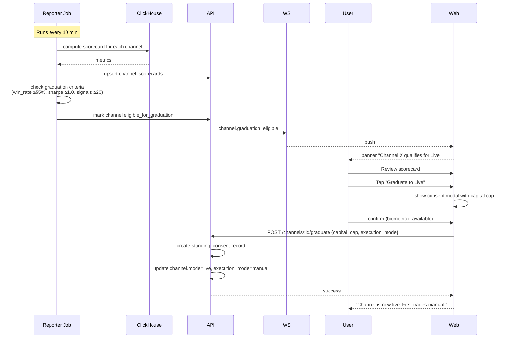

### 7.5 Panic Flow

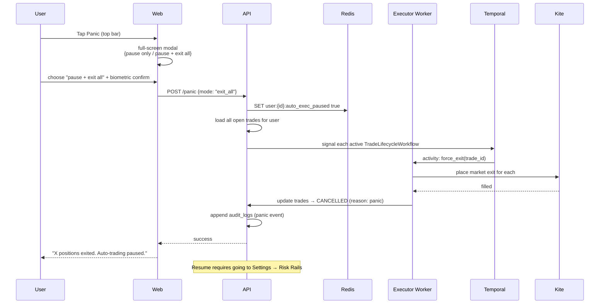

### 7.6 Signal Dedup & Collation

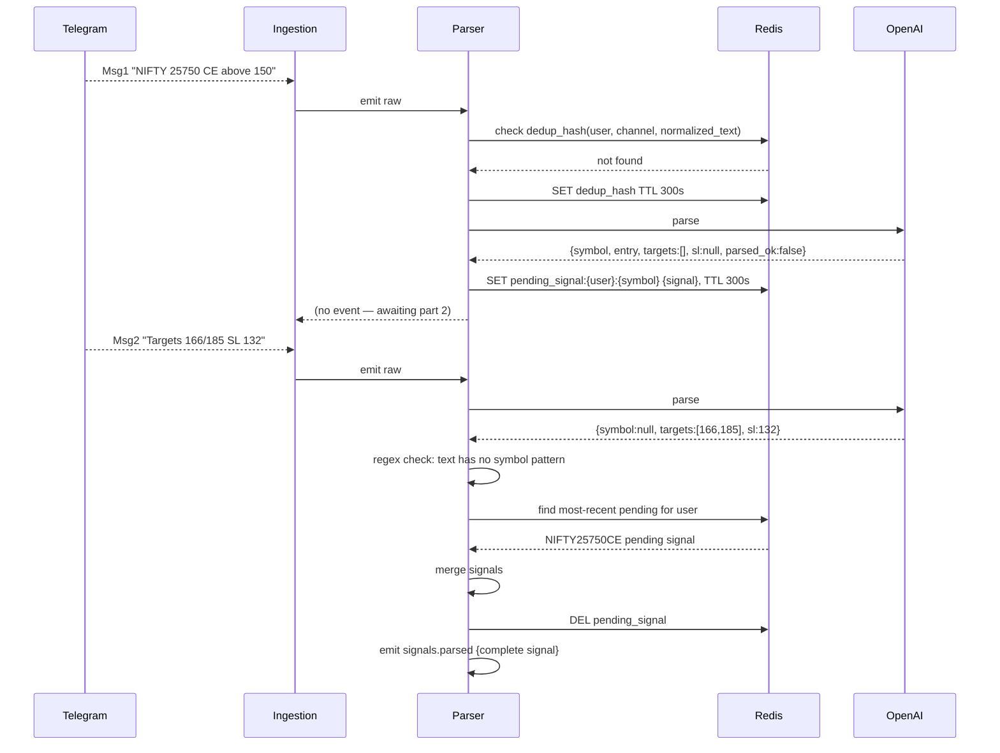

---

## 8. Data Architecture

### 8.1 Storage by concern

| Store | Purpose | Why this store |
|---|---|---|
| **PostgreSQL** | Users, risk profiles, connections, signals (metadata), trades, subscriptions, audit | ACID; RLS for multi-tenancy; JSONB flexibility for parsed signals |
| **ClickHouse** | Signal events, tick samples, scorecards, reports, tax exports | Columnar; cheap for high-cardinality time-series; MV refresh |
| **Redis** | Cache (user sessions, rate limits), streams (signals.raw → parsed), pub/sub (ticks), ephemeral state (pending signal collation) | In-memory; streams with consumer groups; pub/sub for fanout |
| **S3 / R2** | Generated PDF reports, CSV tax exports, user-requested data exports | Object storage; presigned URLs |
| **AWS KMS** | Master keys for envelope encryption of broker tokens and Telegram sessions | Managed key rotation, audit trail |
| **Secrets Manager** | Internal service credentials (DB passwords, API keys) | Automatic rotation, IAM integration |

### 8.2 Row-level security (Postgres)

Every user-owned table has RLS policies:

```sql
ALTER TABLE trades ENABLE ROW LEVEL SECURITY;

CREATE POLICY trades_tenant_isolation ON trades
  USING (user_id = current_setting('app.current_user_id')::uuid);
```

The NestJS global interceptor sets `app.current_user_id` per connection from the authenticated JWT. Attempts to query across tenants fail at the DB layer, not just the app.

### 8.3 Data retention (summary — full schedule in PRODUCT_SPEC Appendix C)

| Data | Hot retention | Cold retention |
|---|---|---|
| Audit logs | 90 days in Postgres | 7 years in S3 Glacier |
| Trades | 2 years | 5 years cold |
| Signals | 180 days | 2 years cold |
| Ticks (sampled) | 90 days | 1 year cold |
| User PII | Until delete + 30d soft | Purge thereafter |
| Secrets | Lifetime of connection + 7-30d grace | Purge |

### 8.4 Backups

- Postgres: WAL continuous + daily snapshots, 30-day point-in-time recovery
- ClickHouse: nightly snapshots to S3
- Redis: AOF for critical queues (idempotency keys, pending signals); other data is ephemeral by design
- Cross-region replication for Postgres and S3 to `ap-south-2` (Hyderabad)

---

## 9. Event-Driven Model

tradeX uses an event-driven backbone for asynchronous work. Events flow through **Redis Streams** with consumer groups.

### 9.1 Event streams

| Stream | Producer | Consumers | Retention |
|---|---|---|---|
| `signals.raw` | Ingestion | Parser | 24 h |
| `signals.parsed` | Parser | Paper, Executor, Notification | 24 h |
| `trades.lifecycle` | Executor, Paper | Notification, Analytics | 7 d |
| `rails.events` | Risk Engine | Analytics, Audit | 30 d |
| `billing.events` | Billing | Notification, Analytics | 90 d |
| `system.health` | All services | Admin, Monitoring | 1 h |

### 9.2 Event envelope

```json
{
  "event_id": "evt_01HNC...",
  "event_type": "signal.parsed",
  "version": 1,
  "occurred_at": "2026-04-25T09:42:11.123Z",
  "trace_id": "4bf92f3577b34da6a3ce929d0e0e4736",
  "user_id": "usr_01HN...",
  "tenant_id": "usr_01HN...",
  "payload": { ... },
  "source": "parser-worker-v1.2.3"
}
```

**Idempotency**: consumers use `event_id` as a natural dedup key. Outbox pattern on the producer side ensures exactly-once delivery from the producer's perspective.

### 9.3 Why not Kafka

At v1 scale (<100k users), Redis Streams provide the same semantics (consumer groups, at-least-once, ack/nack, persistence) with a fraction of the operational cost. We revisit Kafka (or AWS MSK) when we hit:
- >50k events/sec sustained
- Need cross-region replication of event log
- Need 30+ day replayability

---

## 10. API Architecture

### 10.1 REST (primary)

- Base: `https://api.tradex.in/v1`
- Auth: `Authorization: Bearer <JWT>` with tokens from Clerk
- Content: `application/json`
- OpenAPI 3.1 spec at `/v1/openapi.json`, generated from NestJS decorators via `@nestjs/swagger`
- Typed client generated into `packages/sdk-client` via `openapi-typescript-codegen`

### 10.2 WebSocket (real-time)

- URL: `wss://api.tradex.in/v1/stream`
- Auth: JWT passed in `sec-websocket-protocol` header on handshake
- Channels subscribed on connect:
  - `user.{id}` — personal events (signals, trade updates, reauth prompts)
  - `prices.{token}` — per-instrument tick stream
  - `system.health` — connection-status updates

Message format:
```json
{ "type": "signal.parsed", "payload": { ... }, "ts": 1714... }
```

Server sends keepalive pings every 15s; client auto-reconnects with exponential backoff (1s → 30s).

### 10.3 Webhooks (inbound)

Razorpay webhooks → `/webhooks/razorpay` → HMAC signature verification → idempotent processing. Each webhook event stored in `payment_events` with `razorpay_event_id` as unique key.

### 10.4 Conventions

- IDs are UUIDv7 (time-ordered for cursor pagination)
- Pagination: cursor-based, `?cursor=...&limit=50` (max 100)
- Idempotency: `Idempotency-Key` header on POST/PUT; server stores (key → response) for 24h
- Rate limits: per-user (300 req/min), per-IP (60 req/min unauthenticated); 429 with `Retry-After`
- Error shape:
  ```json
  {
    "error": {
      "code": "RAIL_BLOCKED",
      "message": "Daily loss limit of ₹5,000 reached",
      "details": { "rail": "daily_loss", "current": -5200, "limit": -5000 },
      "trace_id": "..."
    }
  }
  ```

---

## 11. Security Architecture

### 11.1 Defense in depth

```
Internet
  ↓ TLS 1.3
Cloudflare (WAF · rate limit · bot detection · DDoS)
  ↓ authenticated origin pulls (mTLS)
AWS ALB
  ↓
ECS Fargate (least-privilege IAM per service)
  ↓
RDS / Redis / ClickHouse (private subnets, SG-restricted)
  ↓
KMS / Secrets Manager (audited access)
```

### 11.2 Encryption

- **In transit**: TLS 1.3 everywhere (CF → ALB → service; service → DB)
- **At rest**:
  - RDS: AWS-managed KMS encryption
  - ClickHouse: KMS-encrypted EBS volumes
  - Redis: In-transit + at-rest via ElastiCache encryption
  - S3: SSE-KMS
- **Application-layer envelope encryption** for ultra-sensitive fields:
  - `broker_connections.encrypted_creds` — AES-256-GCM with per-tenant data key wrapped by KMS master key
  - `telegram_connections.encrypted_session` — same pattern
  - Data keys rotated on every 90 days; old ciphertexts re-encrypted by a migration job

### 11.3 Secrets handling

- No secrets in env files in Git. Pre-commit hook (gitleaks) blocks.
- Runtime secrets from AWS Secrets Manager, injected as env at container start (not in image)
- Per-service IAM role grants least-privilege access to only its secrets
- Audit all Secrets Manager reads via CloudTrail

### 11.4 Authentication & authorization

- Auth: Clerk for identity, then our JWT with custom claims (tier, roles)
- Authorization:
  - NestJS `@Roles(...)` and `@Entitlement(...)` guards
  - Postgres RLS enforces tenant isolation independently of app layer
  - Admin actions require step-up auth (WebAuthn) + audit log

### 11.5 Threat model (top risks)

| Threat | Vector | Mitigation |
|---|---|---|
| Broker credential theft | DB leak, insider | Envelope encryption, key rotation, audit |
| Telegram session leak | Same | Same |
| Auto-execute abuse | Compromised account | Biometric for mode upgrades; capital caps; panic reachable even if session stolen |
| Insider data leak | Rogue employee | No prod data in dev; audit logs off-prod; quarterly access reviews |
| Front-running via signal interception | MITM on TLS (unlikely) | TLS 1.3, HSTS preload, cert pinning for mobile later |
| SQL injection | Parameterized queries via ORMs | Zod/Pydantic validation at edge; no raw SQL in user paths |
| XSS | React escapes by default | Strict CSP, no `dangerouslySetInnerHTML` without security review |
| Supply chain | NPM/PyPI malware | Dependabot, Snyk, lockfile-only installs, internal mirror for critical deps |

### 11.6 Security operations

- Quarterly third-party pen test
- Annual SOC 2 Type II audit (target month 18)
- Bug bounty program via Intigriti or HackerOne (target month 12)
- Incident response playbook in `infra/runbooks/security/`

---

## 12. Multi-Tenancy Model

tradeX is a **shared-infrastructure, row-level-isolated** SaaS.

### 12.1 Isolation at each layer

| Layer | Mechanism |
|---|---|
| **App** | JWT → `userId` → injected into every query; NestJS guards enforce ownership |
| **Database** | Postgres RLS; every table has `user_id` + policy; connection scoped via `SET LOCAL app.current_user_id = ...` |
| **Cache** | Keys namespaced with user_id: `user:{id}:pending_signals`, etc. |
| **Streams** | Consumer groups partitioned by user_id range (hash ring) |
| **Workers** | Ingestion pods pin users via consistent hashing; executor workflows instance-per-trade-per-user |
| **Observability** | Logs include `user_id`; Datadog RUM sessions tagged |
| **Backups** | Per-tenant data export via DPDP endpoint reads all user-scoped data |

### 12.2 Why not a separate DB per tenant

- Operational cost doesn't justify for <100k tenants
- RLS + proper guardrails gives strong enough isolation for financial data
- Per-tenant DB becomes an option in v3 for enterprise / institutional users (different tier)

### 12.3 Tenant lifecycle

1. **Create**: on signup, tenant_id = user_id; row in `users` + `risk_profiles` + empty `paper_wallets`
2. **Active**: normal operation
3. **Paused** (billing failure, compliance flag): tenant marked, auto-exec disabled; read-only access
4. **Soft-deleted** (user-initiated): 30-day cooldown; data retained; sessions revoked
5. **Hard-deleted**: after cooldown + DPDP-compliant data purge; audit log entry stays

---

## 13. Deployment Topology

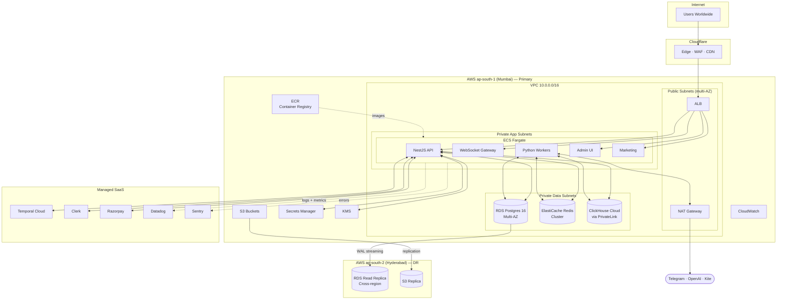

### 13.1 Region & AZ strategy

- Primary: **ap-south-1 (Mumbai)** — user base, NSE latency
- DR: **ap-south-2 (Hyderabad)** — warm Postgres read replica, S3 replication, cold standby for compute (spin up on failover via Terraform)
- Multi-AZ for RDS, Redis, ECS within primary region

### 13.2 Compute

- ECS Fargate for all services — simpler ops than EKS at v1 scale
- Task definitions versioned in Terraform; deploys via GitHub Actions → ECR push → ECS service update
- Blue/green deployments with ECS CodeDeploy integration
- Auto-scaling based on CPU + custom metrics (queue depth, signal rate)

### 13.3 Networking

- VPC with public subnets (ALB, NAT) + private app subnets + private data subnets
- Private subnet egress via NAT Gateway (for calling Kite, OpenAI, Telegram)
- PrivateLink endpoints to Secrets Manager, KMS, S3
- Security groups: restrictive, default-deny, explicit allow only what's needed

### 13.4 DNS

- Cloudflare DNS for `tradex.in`
- A records: `app.tradex.in` → CF → ALB, `api.tradex.in` → CF → ALB
- TTL: 60s for app records (fast failover during incidents)

---

## 14. Environments & Promotion

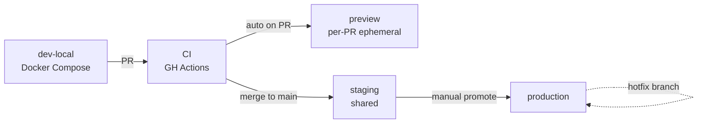

| Env | Compute | Data | Who accesses |
|---|---|---|---|
| `dev-local` | Docker Compose | Seeded fixtures | Developers |
| `ci` | GitHub Actions runners | Ephemeral Postgres | Automated tests |
| `preview` | ECS Fargate (per-PR) | Shared staging data | Reviewers |
| `staging` | ECS Fargate | Synthetic users + test-mode external APIs | QA, integration partners |
| `production` | ECS Fargate | Real | End users, on-call |

### 14.1 Data separation

- Prod DB has its own VPC, its own KMS keys, its own IAM
- No prod data ever copied to staging or dev (DPDP + security)
- Staging uses synthetic data generator with realistic distributions

### 14.2 Deployment windows

- Normal deploys: Tues/Thu 23:00 IST (post-market)
- Emergency hotfixes: anytime, with SEV label + approval
- Market-hours freeze: 09:15-15:30 IST (no deploys, no DB migrations)

### 14.3 Rollback strategy

- ECS CodeDeploy keeps previous task definition; rollback = deploy previous revision (2-min task)
- Postgres migrations designed to be forward-compatible for 2 versions (never drop a column; deprecate first)
- Feature flags gate risky features; instant disable via PostHog UI

---

## 15. Observability Architecture

### 15.1 Three pillars

| Pillar | Tool | Detail |
|---|---|---|
| **Metrics** | Datadog | CloudWatch bridged in; custom service metrics via StatsD |
| **Logs** | Datadog Logs | Structured JSON, trace-id tagged, PII auto-redacted |
| **Traces** | Datadog APM (OpenTelemetry) | Trace from browser click → API → workers → broker |

### 15.2 Distributed tracing

Every incoming request gets a W3C `traceparent`. Propagated through:
- HTTP calls between services
- Redis Streams (embedded in event envelope)
- Temporal workflows (attribute on activities)
- Broker SDK calls (tagged with outgoing requests)

A signal can be traced from Telegram arrival → parse → paper execute → scorecard update → notification delivery as one trace.

### 15.3 Key metrics

See PRODUCT_SPEC §18.1 for SLO targets. Dashboards owned by engineering:

- **User-facing** — RED per API endpoint
- **Signal pipeline** — ingest lag, parse error rate, dedup hit rate
- **Execution pipeline** — order latency per broker, rejection rate, reconciliation drift
- **Business** — signups, activation, MRR, churn

### 15.4 Alerting

PagerDuty routing:
- **SEV-1** — trading blocked for >5% users; page primary immediately
- **SEV-2** — degraded feature; email, page in business hours
- **SEV-3** — minor; slack, handle in standup

Alert noise discipline: any false positive >2/week gets an incident to rewrite the alert.

### 15.5 Session replay

PostHog session replay for user-reported issues. Disabled for sensitive screens (broker connection, 2FA) via data masking rules.

---

## 16. Resilience & Disaster Recovery

### 16.1 Failure modes & responses

| Failure | Detection | Response | User impact |
|---|---|---|---|
| Single service crash | Health check fails | ECS restarts task | <60s blip |
| AZ failure | CloudWatch | ECS reshuffles across AZs | <5min brownout |
| Region failure (primary) | Synthetic monitors | Failover to DR: restore Postgres read replica as primary, DNS cutover | 1-2h outage |
| Postgres corruption | Replica drift | PITR from snapshot | <30min outage |
| Redis outage | Health check | Degrade to Postgres-backed queue (slower); live trading pauses | Degraded |
| Kite API outage | Status polling | Banner; disable new live trades; queue for retry when back | No new auto-trades |
| OpenAI outage | 5xx tracking | Signals queued for manual review; notification sent | Parse delayed |
| Telegram ban of a user session | Telethon exception | Mark session expired; notify user to re-auth | That user affected |
| Clerk outage | Auth fails | Grace: allow existing sessions to continue, no new logins | New signups blocked |
| Razorpay outage | Webhook timeout | Queue with retry; users in grace period not penalized | Billing delayed |

### 16.2 RPO / RTO

| Scenario | RPO | RTO |
|---|---|---|
| Service crash | 0 | 60 s |
| Single AZ | 0 | 5 min |
| Region-wide | <5 min | <2 h |
| Postgres corruption | <5 min (via PITR) | 30 min |

### 16.3 DR drills

Quarterly game day:
- Simulate region failure on a Saturday morning (markets closed)
- Execute runbook from `infra/runbooks/dr/region-failover.md`
- Verify data integrity post-failover
- Measure RTO — target <2h, publicly commit to 4h

### 16.4 Circuit breakers

Application-layer breakers for external dependencies:

- **Kite**: open breaker after 5 consecutive 5xx in 30s → all orders paused, 1-min cooldown, half-open test, full open on success
- **OpenAI**: similar
- **Razorpay**: less critical; retry with backoff, no breaker

Implemented via `opossum` (Node) / `pybreaker` (Python).

---

## 17. Scalability Plan

### 17.1 User milestones & bottlenecks

| Users | Active / day | Bottleneck | Response |
|---|---|---|---|
| 100 | 40 | None | Single ECS service per component |
| 1,000 | 400 | Ingestion pod capacity (~200 sessions/pod) | Scale horizontally; consistent hashing |
| 10,000 | 4,000 | LLM cost (~$50/day); Kite per-user WebSocket | Centralized signal parsing for shared channels; evaluate centralized market feed |
| 100,000 | 40,000 | LLM cost ($500/day); DB write volume | Self-hosted fine-tuned LLM; DB read replicas; Kafka for streams |
| 1,000,000 | 400,000 | Everything rethought | Multi-region active/active; database sharding by user_id hash |

### 17.2 LLM cost strategy

- **v1**: gpt-4o-mini, per-user parsing, ~₹0.008 per signal
- **v1.5**: Fine-tune gpt-4o-mini on accumulated training data from our own parsed signals + golden set, reduce tokens by 30%
- **v2**: Self-host Llama 3.1 8B fine-tuned on GPU cluster; shared per-channel parsing for public channels (parse once, fan out)
- **v3**: Small distilled model for real-time; larger model for offline verification

### 17.3 Market data strategy

- **v1**: User's own Kite WebSocket feed, zero marginal cost to us
- **v1.5**: TrueData or GlobalDatafeeds centralized feed (~₹5k-15k/month) for users without Kite, or as tier premium
- **v2**: Direct NSE feed (requires membership) only if volume justifies

### 17.4 Read vs write scaling

- Reads scale via Postgres read replicas + ClickHouse MV + CDN cache
- Writes concentrated in `signals`, `trades`, `trade_events` tables — partitioned by month at v1.5
- ClickHouse is write-optimized; handles millions of events/hour on modest hardware

---

## 18. Cost Model

Estimated monthly run cost at user milestones (INR).

### 18.1 v1 alpha — 100 users

| Item | Cost |
|---|---|
| ECS Fargate (4 services, 0.5 vCPU / 1GB each) | ₹5,000 |
| RDS Postgres (db.t3.medium multi-AZ) | ₹8,000 |
| ElastiCache Redis (cache.t3.micro cluster) | ₹3,000 |
| ClickHouse Cloud (dev tier) | ₹2,500 |
| Temporal Cloud (dev tier) | ₹2,500 |
| Cloudflare Pro | ₹1,700 |
| Clerk (up to 10k MAU free) | ₹0 |
| Datadog (3 hosts, APM + logs) | ₹8,000 |
| Sentry Team | ₹2,000 |
| PostHog Scale | ₹1,600 |
| Razorpay (transaction fees) | ~₹500 |
| MSG91 (OTP) | ₹500 |
| Resend (email) | ₹500 |
| OpenAI gpt-4o-mini (50 signals/day × 100 users × ₹0.008) | ₹1,200 |
| Misc (domain, SSL extras, tools) | ₹1,000 |
| **Total** | **~₹38,000 /mo** |

### 18.2 Post-launch — 1,000 users (500 paid)

Jumps to ~₹1.2L/mo primarily due to:
- ECS scales to ~₹15k
- RDS scales to ₹25k (db.r6g.large multi-AZ)
- Datadog ₹30k (more hosts)
- OpenAI ₹12k
- Clerk paid tier ₹8k
- Others scale modestly

Revenue at 500 paid @ ₹499 avg = ₹2.5L gross → ~₹1.3L net after infra. Sustainable but margin expands with scale.

### 18.3 Cost controls

- Reserved instances / savings plans at 1k+ users
- Turn off `preview` environments automatically after 7 days idle
- Archive ClickHouse data >90 days to S3 (cheap tier)
- Alert if any line item deviates >20% month-over-month

---

## 19. Architecture Decision Records

Key decisions with rationale. Format: one-pager per ADR in `docs/architecture/adr/NNNN-title.md`. Below is a summary.

### ADR-0001 — Monorepo with Turborepo + pnpm

**Decision**: Single repo for all services.
**Rationale**: Shared types, atomic cross-service changes, consistent tooling. Turborepo's remote caching makes CI fast.
**Tradeoff**: Grows in size; need CODEOWNERS discipline.
**Alternatives considered**: Multi-repo — rejected, too much coordination overhead.

### ADR-0002 — NestJS + FastAPI hybrid

**Decision**: NestJS for API, FastAPI for workers.
**Rationale**: NestJS type-parity with React frontend; Python library ecosystem (Telethon, kiteconnect) mature; salvageable code from legacy bot is Python.
**Tradeoff**: Two languages to hire for, two deployment targets.
**Alternatives considered**: All-Python — rejected for frontend parity. All-Node — rejected for library maturity in financial workers.

### ADR-0003 — Temporal for durable workflows

**Decision**: Use Temporal Cloud for order lifecycle, reauth orchestration, long-running paper sims.
**Rationale**: Orders survive 30 min to 6 hours; process restarts must not lose state. Temporal solves this with event sourcing.
**Tradeoff**: Vendor lock-in; learning curve.
**Alternatives considered**: Bull queues — too simple for our needs. Home-rolled state machine — fragile, don't reinvent.

### ADR-0004 — Postgres RLS for multi-tenancy

**Decision**: Shared database, per-tenant RLS policies.
**Rationale**: Operational simplicity at our scale; strong security with defense in depth (app + DB both enforce).
**Tradeoff**: Hot users can impact noisy neighbors; need careful index design.
**Alternatives considered**: DB-per-tenant — operational overhead too high. Schema-per-tenant — same cost, less security than RLS.

### ADR-0005 — ClickHouse for analytics

**Decision**: Separate OLAP store for signals, trades, ticks, scorecards.
**Rationale**: Scorecard queries scan millions of events; Postgres cannot do this in sub-second at scale.
**Tradeoff**: Two databases, two sets of schema migrations.
**Alternatives considered**: TimescaleDB (Postgres extension) — decent but less optimal for multi-dimensional aggregations. BigQuery — not in ap-south region.

### ADR-0006 — Clerk for auth (v1)

**Decision**: Managed auth via Clerk; reserve option to move to custom.
**Rationale**: Ship 3-4 weeks faster; auth is not a differentiator; Clerk's cost is low until large scale.
**Tradeoff**: Vendor lock-in; migration non-trivial.
**Alternatives considered**: Custom NestJS JWT — more control, 3-4 weeks of build. Supabase Auth — less polished; Auth0 — pricier.

### ADR-0007 — Lightweight Charts over TradingView widget

**Decision**: Use TradingView's OSS charts, not their widget.
**Rationale**: Apache 2.0, no brand pollution, full customization, financial-grade rendering.
**Tradeoff**: Fewer built-in features than widget; need to build advanced indicators.
**Alternatives considered**: TradingView widget — brand pollution, license restrictions. Recharts / ApexCharts — not financial-grade.

### ADR-0008 — Cloudflare + AWS ap-south-1

**Decision**: Cloudflare edge + AWS Mumbai primary.
**Rationale**: Data residency, NSE latency (~10ms to Kite), Cloudflare's WAF is battle-tested.
**Tradeoff**: Cross-vendor complexity.
**Alternatives considered**: AWS-only — CloudFront has weaker WAF and bot detection. Azure/GCP — less India presence.

### ADR-0009 — Redis Streams over Kafka for v1

**Decision**: Redis Streams for event backbone at v1.
**Rationale**: 10x cheaper operationally, same consumer-group semantics, sufficient for <100k users.
**Tradeoff**: Less replayable; need to migrate at scale.
**Alternatives considered**: Kafka — right long-term, wrong for week-1 ops. AWS SQS/SNS — missing stream semantics.

### ADR-0010 — Broker adapter pattern from day one

**Decision**: All broker integrations behind `IBrokerAdapter`; Kite is first implementation.
**Rationale**: Adding Upstox/Dhan later is a contract implementation, not a refactor. Testability — mock broker for tests.
**Tradeoff**: Extra abstraction layer; some Kite-specific features leak through.
**Alternatives considered**: Direct Kite coupling — would require rewrite when adding second broker.

### ADR-0011 — Temporal paper-vs-live shared contract

**Decision**: Paper engine and live executor share the same trade lifecycle code, differing only in the broker adapter (paper vs real).
**Rationale**: Guarantees paper accuracy; a bug in one surfaces in the other.
**Tradeoff**: Tight coupling; changing paper logic means changing live.
**Alternatives considered**: Separate implementations — diverge over time, paper becomes unrealistic, scorecards lose credibility.

### ADR-0012 — Deploy freeze during market hours

**Decision**: No deploys 09:15-15:30 IST unless SEV-1 hotfix.
**Rationale**: Real money at stake; deployment bugs during market hours have blast radius.
**Tradeoff**: Slower iteration cycle.
**Alternatives considered**: Feature-flag-only deploys during market — considered for v1.5.

---

## 20. Glossary

(See PRODUCT_SPEC §33 for product terms. Architecture-specific terms below.)

| Term | Meaning |
|---|---|
| C4 | Context, Containers, Components, Code — hierarchical architecture diagrams |
| RLS | Row-Level Security — Postgres tenant isolation |
| ADR | Architecture Decision Record |
| MV | Materialized View (ClickHouse) |
| WAL | Write-Ahead Log (Postgres durability mechanism) |
| PITR | Point-In-Time Recovery |
| RPO / RTO | Recovery Point Objective (data loss tolerance) / Recovery Time Objective (downtime tolerance) |
| SEV-1/2/3 | Severity levels for incidents |
| SLO / SLI | Service Level Objective / Service Level Indicator |
| BFF | Backend-for-Frontend |
| mTLS | Mutual TLS — both parties authenticate certificates |
| OLTP / OLAP | Online Transactional / Analytical Processing |
| RED metrics | Rate, Errors, Duration (per-endpoint health indicators) |
| Circuit breaker | Pattern: open circuit on repeated failures, preventing cascade |
| Outbox pattern | Write event to DB in same txn as business change; async relay to stream |
| Envelope encryption | Encrypt data with data key; encrypt data key with KMS master key |
| Consistent hashing | Mapping scheme that minimizes reshuffling when nodes change |
| Idempotency key | Client-supplied key; server stores (key → response) to make retries safe |

---

## Appendix A — Order Lifecycle State Machine

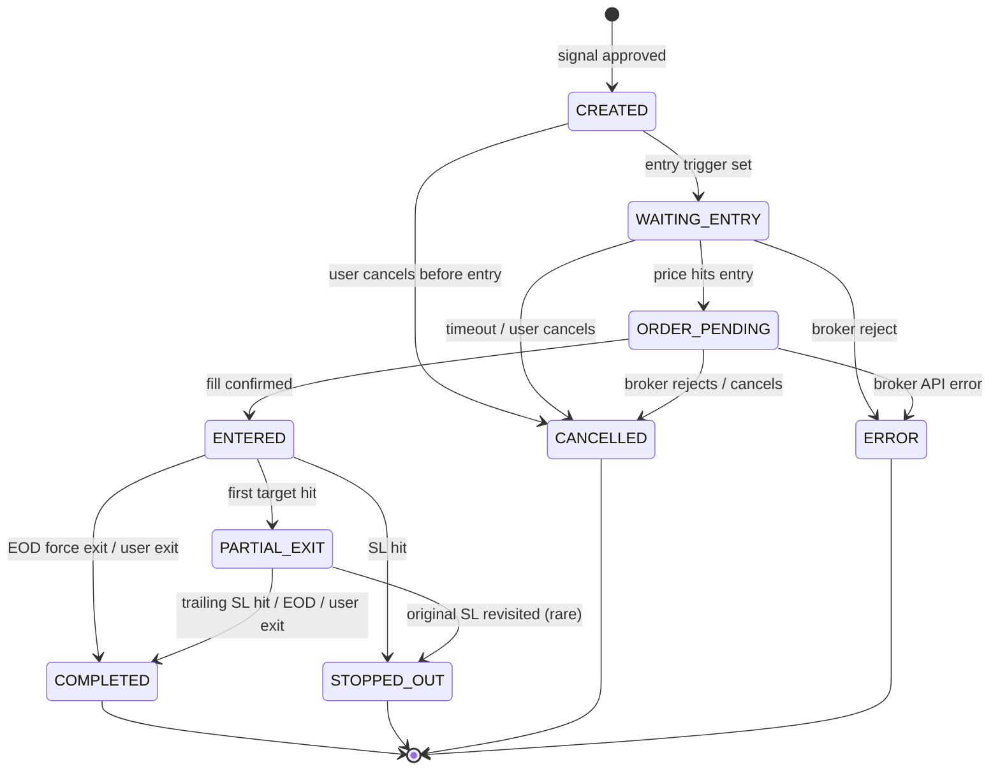

Every transition writes to `trade_events` with actor (user / system / broker), reason, and payload.

---

## Appendix B — Request Trace Example

A single signal traced from Telegram to user notification:

```
trace_id = 4bf92f3577b34da6a3ce929d0e0e4736

 ingestion-worker-1  POST Telegram.get_messages            12ms
   └─ redis-stream   XADD signals.raw                      2ms

 parser-worker-2     XREAD signals.raw                     0ms
   ├─ openai         POST chat.completions                 1,247ms
   ├─ redis          SET dedup_hash                        1ms
   └─ redis-stream   XADD signals.parsed                   2ms

 paper-engine-worker XREAD signals.parsed                  0ms
   ├─ postgres       SELECT paper_wallet FOR UPDATE        5ms
   ├─ redis-pubsub   SUBSCRIBE ticks.{token}               2ms
   ├─ compute fill   (wait for next tick)                  340ms
   ├─ postgres       INSERT trade + trade_event            8ms
   └─ redis-stream   XADD trades.lifecycle                 2ms

 notification-worker XREAD trades.lifecycle                0ms
   ├─ postgres       SELECT user.notification_prefs        4ms
   ├─ web-push       POST FCM                              120ms
   └─ postgres       INSERT notification_log               3ms

 websocket-gateway   (picks up from trades.lifecycle)
   └─ push to client                                       15ms

TOTAL signal-to-user notification: 1,761ms (p95 target < 2000ms) ✓
```

---

*End of document. Maintained in `tradeX/SOLUTION_ARCHITECTURE.md`. Architecture changes require an ADR PR.*
